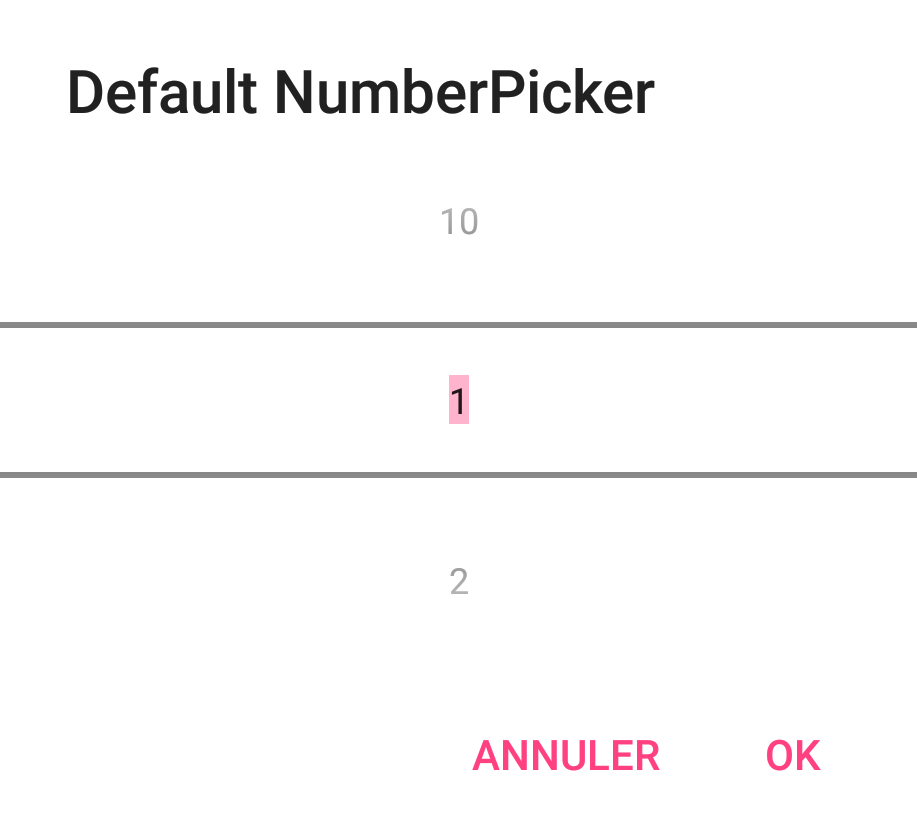
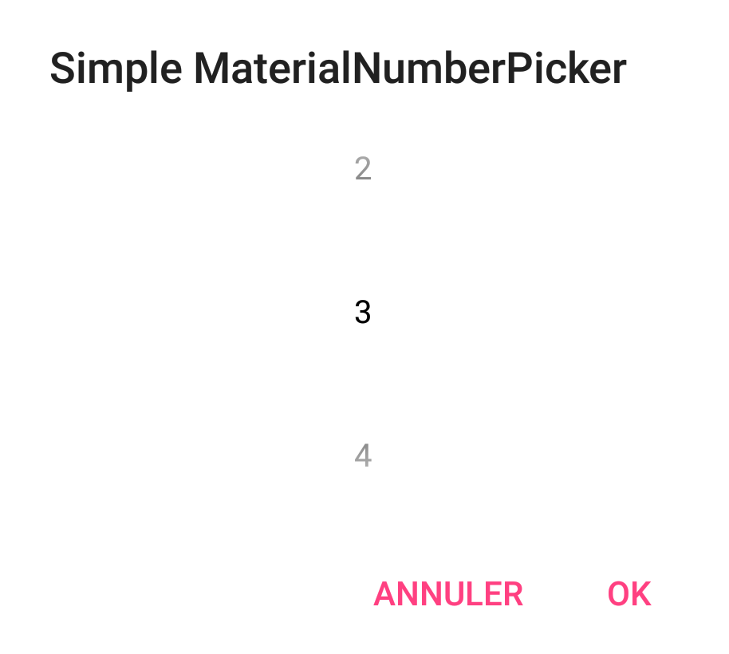
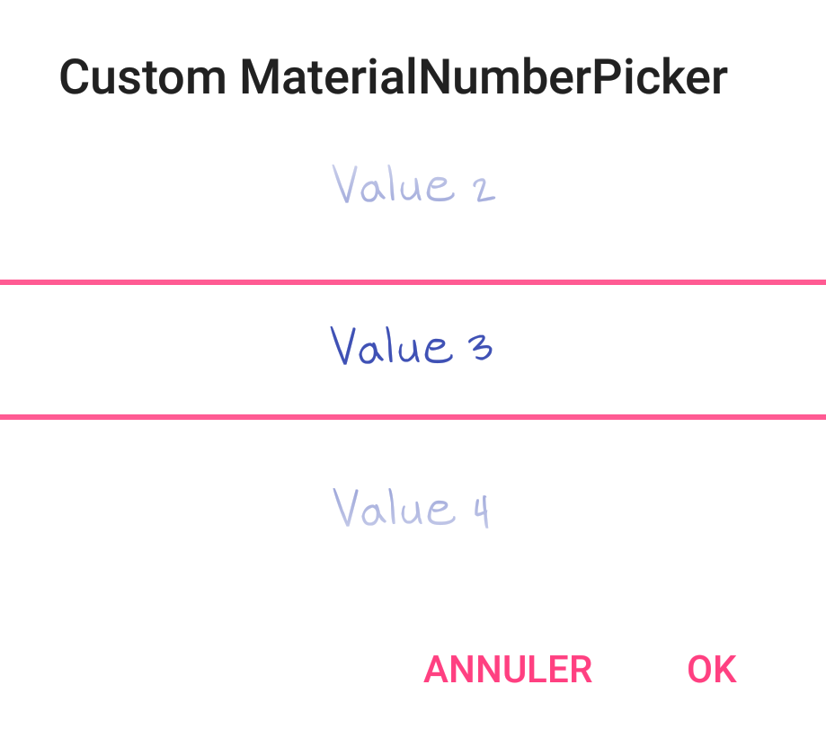

# MaterialNumberPicker

[](https://jitpack.io/#StephenVinouze/MaterialNumberPicker)
[](https://travis-ci.org/StephenVinouze/MaterialNumberPicker)
[](https://android-arsenal.com/api?level=11)
[](https://android-arsenal.com/details/1/6250)
[](https://github.com/StephenVinouze/AdvancedRecyclerView/blob/master/LICENSE)

This library takes over the [repository](https://github.com/KasualBusiness/MaterialNumberPicker) that I originally created but seems no longer maintained. It was ported in Kotlin to provide clearer and more optimized code, and includes various features that are still pending in the previous library. It also provide optionals and nullables with a custom constructor so that you can customize your picker the way you want without using a boredom builder pattern.

Native NumberPicker | MaterialNumberPicker (default) | MaterialNumberPicker (custom)
---- | ---- | ----
 |  | 

## Gradle Dependency

Add this in your root `build.gradle` file:

```gradle
allprojects {
	repositories {
		// ... other repositories
		maven { url "https://jitpack.io" }
	}
}
```

Then add the dependencies that you need in your project.

```gradle
dependencies {
  compile "com.github.StephenVinouze:MaterialNumberPicker:{latest_version}"
}
```

## Usage

Both XML and programmatic instanciations are supported :

```xml
<com.github.stephenvinouze.materialnumberpickercore.MaterialNumberPicker
        android:layout_width="match_parent"
        android:layout_height="match_parent"
        app:mnpDefaultValue="10"
        app:mnpEditable="false"
        app:mnpFontname="Hand.ttf"
        app:mnpMaxValue="50"
        app:mnpMinValue="1"
        app:mnpSeparatorColor="@color/colorAccent"
        app:mnpTextColor="@color/colorPrimary"
        app:mnpTextSize="16sp"
        app:mnpTextStyle="bold"
        app:mnpWrapped="false" />
```

```kotlin
val numberPicker = MaterialNumberPicker(
        context = this,
        separatorColor = ContextCompat.getColor(this, R.color.colorAccent),
        textColor = ContextCompat.getColor(this, R.color.colorPrimary),
        textSize = resources.getDimensionPixelSize(R.dimen.numberpicker_textsize),
        textStyle = Typeface.BOLD_ITALIC,
        defaultValue = 10,
        minValue = 1,
        maxValue = 50,
        editable = false,
        wrapped = false,
        fontName = "Hand.ttf",
        formatter = NumberPicker.Formatter {
            return@Formatter "Value $it"
        }
)
```

Once you have your number picker, you can present it by itself, or within an alert dialog :

```kotlin
AlertDialog.Builder(this)
        .setTitle(title)
        .setView(numberPicker)
        .setNegativeButton(getString(android.R.string.cancel), null)
        .setPositiveButton(getString(android.R.string.ok), { _, _ ->
            Toast.makeText(this, getString(R.string.picker_value, numberPicker.value), Toast.LENGTH_LONG).show()
        })
        .show()
```

The only attribute that cannot be defined through XML is the formatter that is natively included in the `NumberPicker`. It can be directly assigned from the custom constructor when instanciating programmaticaly. Note that all attributes have their own getter/setters and can be upcated anytime durnig your view's lifecycle.
 
We also provide a way to define either your text style within the picker or a custom font. Be aware though that once you define a custom font, the text style will be overriden by the custom font and won't be interpreted. 

## Pull requests

I welcome and encourage all pull requests. I might not be able to respond as fast as I would want to but I endeavor to be as responsive as possible.

All PR must:

1. Be written in Kotlin
2. Maintain code style
3. Indicate whether it is a enhancement, bug fix or anything else
4. Provide a clear description of what your PR brings
5. Enjoy coding in Kotlin :)
